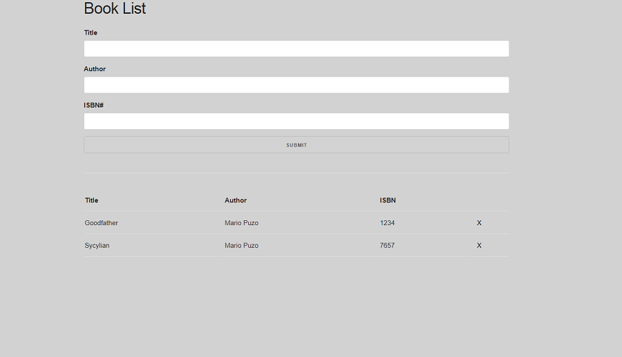

# book-list
Simple Book List App at JavaScript

# Book List App

Book List App in javascript. Created for both mobile and desktop views. It uses skeleton library for css viewing.
You can add, or remove book. All books are store at local storage. This app uses both versions of OOP in javascript, 
Factory Functions as well as classes.

## Tools & Technology used

- Visual Studio Code
- JavaScript
- HTML 
- skeleton
- local storage
